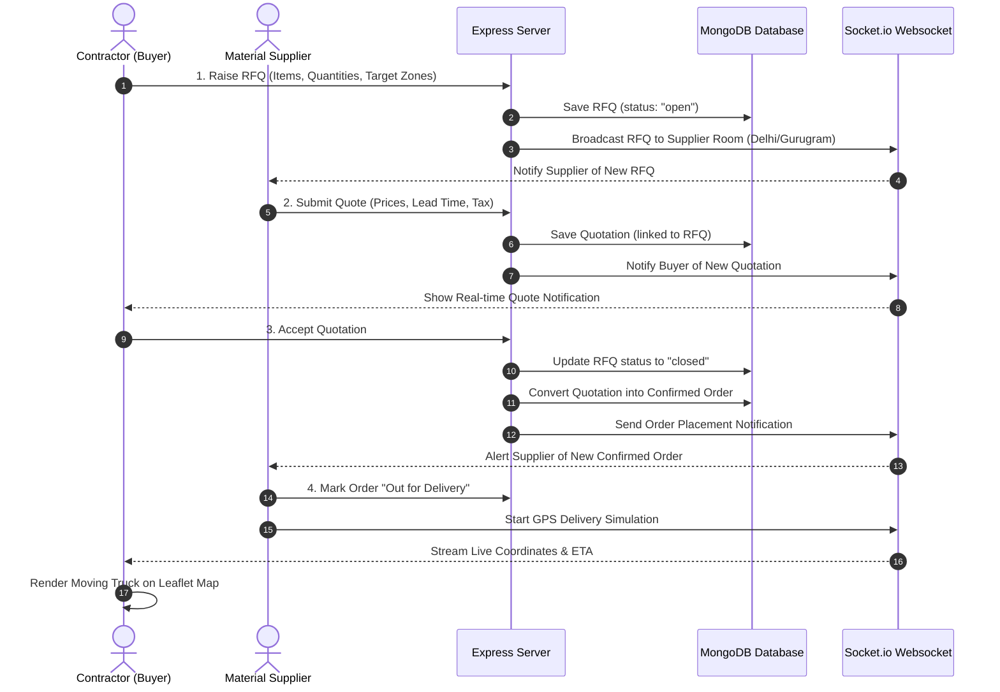

# MODIT — Project Walkthrough, Technology Stack & Interview Preparation Guide

This document is designed to help you explain **MODIT** (a building material discovery, ordering, and Agentic AI procurement platform for Delhi NCR) to companies and interviewers. It outlines the core architecture, workflow stages, technical choices, and provides typical interview questions with standard answers.

---

## 1. Project Overview & Business Value
**MODIT** is a B2B marketplace connecting contractors, builders, architects, and customers with local building material suppliers in the Delhi NCR region (Delhi, Gurugram, Noida, Faridabad, Ghaziabad).

### The Core Problem Solved:
1. **Material Pricing Fragmentation:** Construction materials (cement, TMT steel, sand) do not have unified pricing. MODIT lets buyers compare supplier prices side-by-side.
2. **Inefficient Procurement Lifecycle:** The process of requesting quotes (RFQs) and ordering materials takes days. MODIT automates this to minutes.
3. **Lack of Real-time Logistical Visibility:** Builders need to know exactly when high-volume deliveries arrive. MODIT uses WebSockets to show live delivery trucks on Delhi-NCR maps.

---

## 2. Technology Stack & Rationale

We selected a modern, highly performant stack to ensure rapid responsiveness, scalability, and security:

| Component | Technology | Rationale / Choice Explanation |
| :--- | :--- | :--- |
| **Frontend UI** | **React (Vite) + Tailwind CSS** | Vite provides blazing-fast Hot Module Replacement (HMR) for development. Tailwind CSS allows custom utility-first dark-mode interfaces matching professional dashboards. |
| **State Management**| **Zustand** | Light-weight, boilerplate-free state manager. Handles authentication tokens and cart state cleanly without Redux complexity. |
| **Icons** | **Lucide-React** | Consistent, vector-based iconography. |
| **Backend API** | **Node.js (Express)** | Event-driven, non-blocking I/O is ideal for real-time applications like messaging and real-time logistics. |
| **Database** | **MongoDB (Mongoose)** | Document schema flexibility is perfect for products with varying dimensions/specs (e.g. cement bags vs. steel tons) and dynamic RFQ/quote documents. |
| **Real-time Engine** | **Socket.io** | Two-way WebSocket connection for broadcasting RFQs to suppliers instantly and streaming live GPS coordinates of delivery vehicles. |
| **Maps** | **Leaflet.js + OpenStreetMap** | Open-source mapping alternative to Google Maps. Avoids expensive billing APIs while providing custom overlays, polyline routing, and custom marker support. |
| **Authentication** | **JWT with HttpOnly Cookies** | Secure access token flow. Access tokens are stored in memory, while refresh tokens reside in HttpOnly cookies, protecting against Cross-Site Scripting (XSS) attacks. |

---

## 3. End-to-End System Workflows

Here is the exact execution path of how users interact with the platform:

### Stage 1: Auth & Role-Based Access Control (RBAC)
- **Roles:** `Customer`, `Contractor`, `Supplier`, and `Admin`.
- **Flow:** Users register on the unified page. For contractors/suppliers, business name and GSTIN are required.
- **Security:** Passwords are encrypted using `bcrypt`. The server issues an `accessToken` (sent in JSON response) and a `refreshToken` (saved as an HttpOnly, secure cookie). When the `accessToken` expires, a silent call to `/api/auth/refresh` renews the session.

### Stage 2: Product Discovery & Price Comparison
- **Flow:** Buyers search products by category or query in `Catalog.jsx`.
- **Detail View:** Inside `ProductDetail.jsx`, the system queries the `SupplierProduct` junction model. It renders a comparison table displaying which suppliers sell the product, their individual price per unit, minimum order quantities (MOQ), and average delivery time.

### Stage 3: RFQ Broadcasting Lifecycle (Procurement)
- **RFQ Creation:** A Contractor specifies their required products, quantities, target zones (e.g. Delhi, Gurugram), and response deadline.
- **Broadcast:** The server saves the RFQ, looks up active suppliers servicing those NCR zones, and triggers a Socket.io broadcast to the corresponding supplier room.
- **Quoting:** Suppliers see the open requests, input unit bid prices, and specify their delivery lead times. Mongoose saves these bids as `Quotation` documents.

### Stage 4: Order Conversion & Live GPS Logistical Map
- **Acceptance:** The contractor views the quotes, selects a bid, and clicks "Accept Quote". Mongoose atomically updates the RFQ to `closed`, marks the quotation as `accepted`, and generates a confirmed `Order` document with item breakdowns, GST, and totals.
- **Delivery Simulation:** When the supplier dispatches the items, they update the order status. The server triggers a live tracking stream. Socket.io pushes simulated GPS coordinate updates representing Delhi-NCR transit. The client page (`OrderTracking.jsx`) intercepts these coordinates and animates a custom delivery truck marker along a dotted route path overlaying a dark-themed Leaflet map layer.

---

## 4. How to Pitch & Describe This Project to an Interviewer

### The "Elevator Pitch" (For Recruiters or HR):
> "I built MODIT, a B2B material discovery and procurement platform designed for the Delhi-NCR market. It allows contractors and builders to discover materials, run side-by-side price comparisons across multiple regional suppliers, raise broadcast RFQs, and order materials. The system also includes real-time order tracking that streams delivery vehicle coordinates using WebSockets onto a Leaflet map. It is built using the MERN stack with a strong focus on secure authentication, role-based controls, and real-time state synchronization."

### The "Deep-Dive Pitch" (For Technical Leads or Senior Engineers):
> "My focus while building MODIT was on creating a robust event-driven workflow.
> - **On the backend**, I modeled the procurement process using flexible Mongoose schemas representing RFQs, Quotations, and Orders. I leveraged Socket.io for room-based real-time event distribution: separating notifications by user and supplier rooms based on Delhi NCR delivery zones.
> - **On the security side**, I implemented a stateless JWT authorization flow featuring an HTTP-Only Cookie refresh token exchange, protected by custom Axios response interceptors on the React client.
> - **On the frontend**, I utilized Zustand for clean state containment, and integrated Leaflet with OpenStreetMap layers to plot active delivery paths, using divIcons and path history arrays to animate vehicle movement in real time."

---

## 5. Potential Interview Questions & Curated Answers

### Q1: Why did you choose MongoDB for a marketplace instead of a relational database like PostgreSQL?
*   **Answer:** "Construction materials have highly variable specifications. A bag of OPC cement has specs like 'setting time' and 'grade', while a steel rebar has 'length' and 'diameter'. MongoDB's flexible schema (specifically using `Map` fields for specifications) allowed me to store all product types in a single collection without complex join tables. Furthermore, RFQs and Quotations are nested data structures that map naturally to document structures, making document storage clean and fast for retrieval."

### Q2: How did you implement real-time delivery tracking? Explain the architecture.
*   **Answer:** "I integrated Socket.io on both Express and React.
    1. When a buyer opens the tracking page, the client triggers a socket connection and joins a specific order room: `socket.emit('track_order', orderId)`.
    2. When the supplier dispatches the order, the server handles location telemetry or triggers a simulator loop.
    3. The server pushes updates exclusively to the order's room: `io.to('order_' + orderId).emit('delivery_location_update', coordinates)`.
    4. The React client listens for this event, updates the React state with the new coordinate object, and appends it to a path history array. This causes React-Leaflet to re-render the marker at the new coordinate and draw a dashed Polyline showing the transit history."

### Q3: What is the benefit of storing the Refresh Token in an HttpOnly cookie rather than LocalStorage?
*   **Answer:** "Security against Cross-Site Scripting (XSS) attacks. If an attacker injects a malicious script via a third-party package or inline code, they can read anything in `localStorage`. By setting the refresh token as `HttpOnly`, JavaScript cannot access it (`document.cookie` returns empty for it). The browser automatically appends the cookie to requests sent to `/api/auth/refresh`, allowing us to keep access token lifetimes short (e.g. 15 minutes) and securely renew sessions."

### Q4: Vite is used for the frontend instead of Create React App (CRA). Why?
*   **Answer:** "CRA uses Webpack, which bundles the entire application during development before launching the server. Vite uses native ES Modules (ESM) to load only the required modules on-demand. Additionally, Vite utilizes esbuild (written in Go) for pre-bundling dependencies. This makes startup speeds near-instantaneous and Hot Module Replacement (HMR) extremely fast, which drastically speeds up developer iteration cycles."

### Q5: How did you prevent circular dependencies when using Axios interceptors with your auth store?
*   **Answer:** "To avoid importing the Zustand store directly into the Axios config file (which would cause a circular import lock since API calls are imported by store actions), I used `localStorage.getItem('accessToken')` directly inside the request interceptor. When a 401 response occurs, the interceptor calls a separate refresh API route and saves the new token back to `localStorage`. This keeps the API client stateless and decoupled from the React state store."

### Q6: If 10,000 suppliers are active, how would you optimize Socket.io broadcasts so the server doesn't crash?
*   **Answer:** "Instead of broadcasting RFQs globally, I implemented targeted rooms. In our schema, suppliers service specific geographical zones (e.g., 'Delhi', 'Gurugram'). In production, suppliers join rooms specific to their service zones: `socket.join('zone_' + zoneName)`. When an RFQ is raised for Delhi, we only emit to `io.to('zone_Delhi')`. This reduces the payload count from $O(N)$ (where $N$ is all users) to $O(M)$ (only matching suppliers), preventing socket message bottlenecks."

### Q7: Explain the relationship between the RFQ, Quotation, and Order schemas.
*   **Answer:**
    - An **RFQ** contains an array of item references and target zones. It is created by a buyer and remains `open` until the deadline.
    - A **Quotation** represents a supplier's bid on a specific RFQ. It references the parent `rfqRef` and contains a list of unit prices and a delivery lead time.
    - An **Order** is created when the buyer accepts a specific Quotation. The server reads the accepted quotation, copies the pricing structure, calculates tax (GST) and final amounts, creates the Order document referencing the buyer and supplier, and updates the RFQ status to `closed` to disable further quoting.

### Q8: What measures did you take to handle Leaflet image asset breaking issues inside Vite?
*   **Answer:** "By default, Leaflet dynamically references marker images from its package files. During a Vite build, asset paths are hashed and relocated, which breaks Leaflet's internal lookup, causing marker icons to appear broken. I resolved this by deleting Leaflet's default icon handler prototype and explicitly resetting the retina, marker, and shadow image URLs to public URLs (e.g., from Leaflet CDN assets) using `L.Icon.Default.mergeOptions`."

### Q9: How did you handle input validation, specifically GSTIN format?
*   **Answer:** "I implemented a strict 15-digit alphanumeric Regular Expression check on the frontend during supplier registration: `/^\d{2}[A-Z]{5}\d{4}[A-Z]{1}[A-Z\d]{1}[Z]{1}[A-Z\d]{1}$/`. This ensures the GST number adheres to the official format issued by the Government of India (state code, PAN details, entity code, checksum) before submitting registration payloads."

### Q10: How would you scale this platform to support payment collection and billing?
*   **Answer:** "I would integrate Razorpay or Stripe. During checkout (either direct order or quote acceptance), the client would call our backend to create a transaction session. The client would open the SDK modal. Once payment succeeds, the gateway webhooks would alert our server, which would mark the Order's `paymentMode` as `prepaid`, update the order status to `confirmed`, and generate a GST-compliant invoice PDF via a library like `pdfkit` or `puppeteer`, mailing it automatically to the buyer."

---

## 6. Exporting this Guide to PDF

You can easily export this guide to PDF:
1. Open this file in **VS Code**.
2. Install the **Markdown PDF** extension.
3. Right-click inside this document and select **Markdown PDF: Export (pdf)**.
4. Alternatively, open it in any markdown renderer, press `Ctrl+P` and choose **Save as PDF**.
